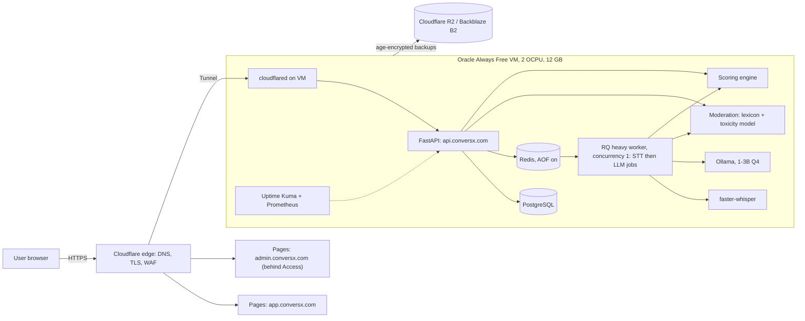

# ConversX: Master Build Prompt (v4)

Paste this whole file into Antigravity as the task prompt (or attach it and tell the agent to follow it). It is self-contained: nothing refers to outside documents.

---

## 0. Role and rules of engagement

You are the **Lead Architect, Full-Stack, DevOps and ML Engineer** for **ConversX**, a communication-training web app: spoken and written practice with AI role-play, deterministic scoring, a progress dashboard, and safe-communication moderation.

1. Work milestone by milestone (Section 13). **Do not start the next milestone until the current one's acceptance criteria pass.** Record results in `docs/PROGRESS.md`.
2. **Never invent measurements.** Performance targets in this prompt are starting hypotheses. The Week 1 benchmark on the real VM sets the final numbers; record them in `docs/BENCHMARKS.md`.
3. **Never invent facts about free tiers, laws or library behaviour.** Before relying on a limit, check the provider's current official documentation and note the source URL and date in `docs/FREE_TIER.md`. If something cannot be verified, say so.
4. If a requirement conflicts with the free tier, the RAM budget, security or law, **stop and write the conflict to `docs/DECISIONS.md`** with options and a recommendation. Do not silently work around it.
5. No secrets in the repo, ever. No paid APIs, no paid services, no trials that expire. (The only expected cost is the domain name; see Section 3.)
6. Every security-relevant behaviour needs an automated test. A milestone touching auth, cookies/CSRF, moderation, audit log, admin access, privacy or backups is **not done** without passing test output recorded in `PROGRESS.md`.

## 1. Session continuity and handoff

Work may be paused and resumed by a different model or developer with no memory of earlier sessions.

1. **At the start of every session**, read `docs/PROGRESS.md`, `DECISIONS.md`, `BENCHMARKS.md`, `FREE_TIER.md` and `HANDOFF.md` (if present) before changing anything. Continue from the current milestone; do not restart or re-plan finished work.
2. **Commit only at green checkpoints**: tests pass and the working tree is clean. Do not leave half-finished changes uncommitted.
3. **After every milestone**, update `PROGRESS.md`: what is done, test results, known issues, next task.
4. **When asked for a handoff, or when context or quota runs low**, write and commit `docs/HANDOFF.md`: current milestone and status, anything half-finished, exact next steps, open bugs, the commands to run all tests, and decisions awaiting the owner.
5. Chat history is never the source of truth. If it matters, it goes in the repo.

## 2. Product scope

- **Conversation practice**: AI role-play scenarios (interview, presentation, negotiation, small talk, complaint handling) by text or voice. **All conversations are with the AI. There is no user-to-user messaging.**
- **Speaking practice**: browser microphone, transcription, then metrics: filler count, pace, pauses, clarity, vocabulary, grammar, confidence indicators.
- **Chat practice**: text replies evaluated for clarity and tone, with a suggested better reply.
- **Scoring and dashboard**: component scores and one communication score, history charts, streaks, daily challenges.
- **Safety and moderation**: server-side checks with warnings and temporary suspensions, explanations, appeals, admin review.
- **Admin**: review violations, suspensions, bans and appeals.
- **Eligibility**: **18+ only for the MVP** (see Section 11). Under-18 sign-up is blocked; a parental-consent flow is out of scope until legal advice says otherwise.

## 3. Hard constraints and the free-tier register

| Area | Constraint |
|---|---|
| Frontend | Static React + Vite + TypeScript on **Cloudflare Pages**: `app.conversx.com` (users) and `admin.conversx.com` (admin, separate Pages project) |
| Backend | FastAPI (Python 3.11+) in Docker on **Oracle Always Free Ampere A1: 2 OCPU, 12 GB RAM** (arm64), at `api.conversx.com` via **Cloudflare Tunnel** (outbound-only; **no inbound ports**) |
| Database | PostgreSQL 16 on the VM, schema changes only through **Alembic** |
| Queue | **RQ + Redis** with **AOF persistence** (`appendonly yes`, `appendfsync everysec`) |
| AI | No paid AI APIs. faster-whisper (STT), Ollama (LLM), open-source toxicity model, all local |
| Images | All images **linux/arm64**; one backend image runs the API and the workers |
| Email | **Brevo** free plan (about 300 emails/day, verify) for verification, reset, suspension and appeal notices |
| Backups | **Cloudflare R2** (about 10 GB free; verify operation limits), optional **Backblaze B2** as a second copy |
| Domain | `conversx.com` must be registered: **this is the one non-free item.** Cookies sharing `.conversx.com` and Cloudflare Access need a real domain. Record the cost in `DECISIONS.md`. `*.pages.dev` is for previews only and must never receive production cookies |

**Free-tier risks to handle explicitly (write mitigations in `FREE_TIER.md`)**
- **Oracle may reclaim "idle" Always Free instances** and Ampere capacity can be unavailable. Have an off-Oracle encrypted backup, a tested restore drill, and a documented rebuild procedure. Monitor utilization against Oracle's idle criteria. Do not add fake load; the real workloads and monitoring stack are the intended usage. Upgrading the account is an option to put in `DECISIONS.md`, not a default.
- Re-verify before launch: Pages build limits, R2 storage and operation limits, Brevo daily cap, Cloudflare Access user cap (about 50), Turnstile, GHCR storage for private images, GitHub Actions minutes, Oracle block-volume allowance.
- Add usage alerts at 70% of every limit.

## 4. Repository layout

```
/frontend            React + Vite + TS (app and admin as two Pages projects)
/backend
  /app               FastAPI: routers, services, models, schemas
  /workers           RQ worker entrypoints
  /alembic
  /tests
/infra
  docker-compose.yml
  /cloudflared       tunnel config template
  /scripts           deploy.sh backup.sh restore.sh restore-drill.sh
  /systemd           timers and units
/docs                ARCHITECTURE.md SECURITY.md RUNBOOK.md SCORING.md PRIVACY.md
                     DECISIONS.md BENCHMARKS.md FREE_TIER.md PROGRESS.md HANDOFF.md
/.github/workflows
.env.example
.pre-commit-config.yaml
```

## 5. Architecture



Pages sites reach the API directly over HTTPS (they are not behind the tunnel). They are **same-site but cross-origin**, which is why CORS and CSRF protection are both required.

**One heavy worker, concurrency 1**, consumes the `stt` and `llm` queues so speech and LLM computation never run at the same time. Lightweight work (text moderation, scoring, dashboard reads) runs in the API.

### Speech flow

1. Client shows the **audio consent** dialog (versioned, timestamped, stored) before the first recording. No consent, no recording.
2. `MediaRecorder` records (maximum duration set by Week 1 benchmark; default cap 60 s) and uploads to `POST /api/v1/speech/jobs`.
3. API validates: session, CSRF, quota, size, **MIME by sniffing bytes (never trust filename or Content-Type)**, duration. Writes to a temp dir with a random name, creates a `jobs` row (`queued`), enqueues to `stt`, returns `202 {job_id}`.
4. Worker runs faster-whisper with `word_timestamps=True` and an `initial_prompt` containing fillers. **It deletes the audio in a `finally` block.** A cron sweep removes orphaned audio older than 15 minutes.
5. Same job continues: moderation, then scoring, then persist.
6. Client polls `GET /api/v1/jobs/{id}` (backoff 1 s to 5 s, stop at 120 s) until `done` or `failed`. Jobs expire after 24 h.
7. Reliability: RQ retries (max 2), per-job timeout, Redis AOF, and a **reconciliation task** that marks stale `queued`/`started` jobs as `failed` with a retry hint after a Redis or worker restart.
8. Quotas enforced server-side: STT minutes per user per day, LLM requests per day, one queued job per user at a time.

### Text and LLM flow

`POST /api/v1/chat/messages` runs moderation first. If allowed, the LLM turn is a job on the `llm` queue; the client polls. The LLM output is moderated before it is returned. If the queue wait exceeds 30 s or Ollama is down, return a scripted scenario turn and template-based feedback so the app stays usable.

### Data model (minimum)

`users, email_tokens, refresh_tokens, consents, scenarios, sessions, messages, jobs, scores, violations, strikes, suspensions, bans, appeals, quotas, audit_log, moderation_events`. All created through Alembic.

## 6. Resource budget (verify in Week 1)

| Component | Target RAM |
|---|---|
| faster-whisper (`base` or `small`, int8) | 0.7 to 1.3 GB |
| Ollama + 1 to 3B Q4 model | 1.5 to 3 GB |
| Toxicity model | 0.4 to 0.8 GB |
| PostgreSQL | 0.6 GB |
| Redis | 0.2 GB |
| API, worker processes | 1.2 GB |
| Prometheus (short retention) + Uptime Kuma | 0.6 GB |
| cloudflared, Docker daemon, OS | 1.2 GB |
| **Headroom** | **3.5 GB or more** |

- Add a 4 GB swap file; set Docker memory limits per container; `OLLAMA_MAX_LOADED_MODELS=1`.
- **Grafana is excluded by default** (about 0.5 GB+). Add it only if measured headroom allows, or use Grafana Cloud's free tier.
- **LanguageTool (Java, about 1 GB) is excluded by default.** Use rule-based grammar checks (spaCy plus heuristics) unless Week 1 shows room. Record the choice in `DECISIONS.md`.
- Candidate models to benchmark (verify availability and licences): Whisper `base`/`small`; LLM from the Qwen2.5, Llama 3.2 and Gemma 2 small families at Q4. **The benchmark chooses; do not assume.**

## 7. Security requirements

**Passwords and sessions**
- **Argon2id** (`argon2-cffi`), minimum OWASP parameters: memory 19 MiB, 2 iterations, 1 lane (raise if the VM allows). Min password length 10, check against a common-password list.
- Short-lived **access JWT (15 min)** and **rotating refresh token** (stored hashed, server-side revocable, reuse detection revokes the family).
- Cookies: `__Secure-` prefix, `HttpOnly; Secure; SameSite=Lax; Domain=.conversx.com; Path=/`. **Tokens never in localStorage, sessionStorage or JS-readable cookies.**
- Signup protected by **Cloudflare Turnstile** (verified server-side). Email verification required before practice features.
- Login rate limits per IP and per account in Redis (e.g. 5 failures per 15 min, then backoff). Generic error messages, no account enumeration. Password-reset and verification tokens: single-use, expiring, stored hashed.

**CSRF and CORS**
- CSRF protection is required for every state-changing request: double-submit token (CSRF cookie readable by JS, matching `X-CSRF-Token` header) plus an `Origin` header allowlist check.
- CORS allowlist is exactly `https://app.conversx.com` (and `https://admin.conversx.com` for admin routes) with credentials. No wildcards.
- Security headers on Pages (`_headers`) and API: strict CSP, HSTS, `X-Content-Type-Options`, `Referrer-Policy`, `Permissions-Policy` (microphone for the app origin only).

**Authorization and admin**
- `user_id` **never** comes from the request body; it comes from the session. Every user-data query is scoped to the session user. Tests must include IDOR attempts.
- **Admin**: `admin.conversx.com` and `api.conversx.com/api/v1/admin/*` are each covered by a **Cloudflare Access** application (MFA enforced at the identity provider). The API independently verifies the Access JWT (signature, issuer, audience, expiry) **and** `role=admin` in the DB. Admin endpoints are unreachable without both.
- Admin actions are written to the audit log with the admin identity.

**Network and abuse**
- Cloudflare SSL **Full (strict)**; OCI security list denies all ingress; SSH only via Cloudflare Access SSH or OCI Bastion.
- Cloudflare WAF managed rules on, plus rate-limit rules for `/api/v1/auth/*` and `/api/v1/speech/*`.
- Upload validation and quotas as in Section 5.

**Supply chain and secrets**
- `.env.example` only; real secrets via environment or Docker secrets on the VM; GitHub Actions secrets for CI.
- `gitleaks` pre-commit and in CI; `pip-audit`, `npm audit`, Trivy on images (fail on high); Dependabot; pinned versions; Actions pinned to commit SHAs before launch.

## 8. Moderation policy

**Automation warns, blocks and temporarily suspends. Only an admin can ban.**

Detection runs **server-side inside every pipeline** (text, transcripts, LLM output). There is no client-callable "safety-check" that gates anything.

1. **Normalization**: case, Unicode confusables, leetspeak, repeated characters, word-boundary matching (avoid Scunthorpe-type false positives).
2. **Lexicon**: maintained word lists for English, Hinglish and Tamil/Hindi transliteration. List sources in `SECURITY.md`. Keep them in versioned data files.
3. **Toxicity model**: Detoxify `original` (English). **Detoxify's multilingual model covers only a handful of languages (EN, FR, ES, IT, PT, TR, RU), is heavier, and will not catch Hindi, Tamil or Hinglish abuse.** For those languages rely on the lexicon with conservative thresholds. Optionally evaluate a small multilingual model in Week 1 only if RAM allows.
4. **Scenario context**: each scenario has `intensity: calm | confrontational`. In `confrontational` role-plays, harsh language aimed at the **AI character** uses higher thresholds and yields a warning, not a strike. **Slurs and threats always count**, whatever the context.

| Level | Trigger | Action |
|---|---|---|
| `ok` | below thresholds | proceed |
| `warn` | minor profanity, borderline | allow or ask to rephrase, show explanation, log |
| `strike` | severe toxicity, slurs, threats | block message, record strike, show explanation |
| `suspend` | **3 strikes within a rolling 7 days** | automatic **24 h suspension**, flagged for admin review |
| `extended` | a further strike within 30 days of a suspension | longer suspension, **admin review required** |
| `ban` | **admin decision only** | permanent or long-term, with recorded reason |

- Strikes stop counting after 30 days but stay in the log.
- Users always see the category, confidence and reason (never the full internals).
- **Appeals**: one per suspension or ban. Admin approves or rejects with notes; approval lifts the action and removes the strike. User is notified by email.
- Required tests: a labelled false-positive set (e.g. "assassin", "class", "Scunthorpe", Indian names, code-switching) with a documented target false-positive rate; role-play cases showing warning-not-strike; 100+ list entries checked.

## 9. Scoring (deterministic)

Document exact formulas and weights in `docs/SCORING.md`.

- **Vocabulary**: MTLD for texts of at least 50 words; **root TTR** for 15 to 49 words; below 15 words return `insufficient_data` rather than a score.
- **Clarity**: average sentence length, long-sentence ratio, repetition, and for speech: pause and pace statistics from word timestamps (target pace band about 110 to 160 wpm).
- **Grammar**: rule-based checks by default (Section 6).
- **Fillers**: count `um, uh, er, hmm, like, you know, basically, actually, sort of`, with context rules for "like". Seed Whisper with a filler-containing `initial_prompt`, then **test that fillers survive transcription on recorded samples**. If they do not, report filler count as a lower bound.
- **Confidence indicator**: pace stability, pause ratio, hedging phrases.
- **Communication score**: `overall = 0.35*clarity + 0.30*grammar + 0.25*vocabulary + 0.10*confidence`. These are starting weights; tune against the golden set. Every sub-score is clamped to 0 to 100; no NaN or negative values.
- **Golden tests**: at least 30 predefined phrases/transcripts (beginner, intermediate, advanced, filler-heavy, too short, gibberish) with expected score ranges. CI fails on drift.

## 10. LLM role-play and feedback

- One quantized instruct model via Ollama, 1 to 3B, chosen by benchmark. Jobs are processed one at a time.
- Functions: (a) scenario opening and next in-character turn; (b) given a user reply, a clearer rewrite plus one-sentence reason.
- Safety: system prompt kept separate from user content; user text wrapped as untrusted data; capped input and output length (about 100 to 150 tokens out); never reveal the system prompt; **moderate LLM output**; low temperature for rewrites.
- Required tests: a prompt-injection set (instruction override, prompt-leak, role escape, toxic-output coaxing) with documented pass rate.
- Fallback to scripted scenarios and template feedback when the queue or Ollama fails.

## 11. Privacy, logging, audit, compliance

*This is engineering guidance, not legal advice. Have the owner confirm these points with qualified counsel before launch.*

- **Eligibility**: 18+ only for the MVP (India's DPDP Act treats under-18s as children and requires verifiable parental consent). Collect date of birth at signup, block under-18, state the rule in Terms. Self-declaration is not verification; record this limitation in `PRIVACY.md`.
- **Consent and notice**: privacy notice and Terms before signup; versioned **audio consent** with timestamp; a way to withdraw consent. Provide a contact for grievances and a breach-response procedure in `PRIVACY.md`.
- **Raw audio**: processed then deleted (data flow above). Never in backups. A test checks the temp dir is empty after success **and** failure.
- **User rights**: export (`GET /api/v1/me/export`) and deletion (`DELETE /api/v1/me`). Deletion removes profile, sessions, transcripts, scores. Audit and moderation rows are **pseudonymized** (salted hash id, tombstoned text), not deleted.
- **Retention**: message content 90 days; moderation metadata 12 months; refresh tokens until expiry; email logs per provider. Automatic purge job.
- **Append-only audit**: `audit_log` and `moderation_events`. The app DB role has `INSERT, SELECT` only; a trigger rejects `UPDATE/DELETE`. Retention purges and pseudonymization run under a **separate DB role** through an admin-only script that is itself audited. Optional hash-chain column for tamper evidence.
- Regular users cannot touch log tables; only admins, through the separate interface.

## 12. Email

Brevo via API or SMTP. Domain authentication (SPF, DKIM, DMARC) configured in Cloudflare DNS. Emails: verification, password reset, suspension notice, appeal outcome. Daily cap guard below the provider limit; on exhaustion fail gracefully and queue. Never reveal whether an address is registered.

## 13. 12-week plan

Targets are hypotheses until Week 1 sets them. "Gate" means: stop if it fails and replan.

| Week | Milestone | Acceptance criteria |
|---|---|---|
| **1** | **Benchmark gate only**: VM, Docker, swap, Tunnel, repo skeleton, CI skeleton. Benchmark Whisper, LLM, toxicity model and full-stack RAM | `BENCHMARKS.md` with real numbers; model sizes chosen; `FREE_TIER.md` started with sources; "hello" API reachable only via Tunnel and `nmap` shows no open inbound ports. **Gate**: 30 s clip RTF ≤ 2.0 (≤ 60 s), LLM ≥ 5 tokens/s, full stack ≤ 8.5 GB peak. If missed, step models down and record in `DECISIONS.md` |
| **2** | **Auth and security baseline**: signup/login, Argon2id, cookies, refresh rotation, CSRF, CORS, Turnstile, rate limits, Brevo verification/reset, 18+ gate, security headers | Tests pass: brute-force lockout, CSRF rejection, IDOR rejection, cookie flags, token reuse detection, no tokens in JS-accessible storage; `SECURITY.md` v1 |
| **3** | **Moderation v1 + text chat**: lexicon, normalization, strikes, context rule, append-only audit log, scenarios, scripted chat turns | False-positive and role-play tests pass; UPDATE/DELETE on audit tables fails for the app role; each warn shows an explanation. Chat only goes live with moderation on |
| **4** | **Scoring engine (text)**: formulas, `SCORING.md`, golden tests | 30+ golden cases in range; no NaN or negatives; 85%+ unit coverage of the scoring module; text endpoint p95 < 500 ms |
| **5** | **Speech pipeline**: consent, MediaRecorder, upload validation, RQ heavy worker, Redis AOF, polling, audio deletion | 30 s clip within Week 1 target; audio deleted on success **and** failure; Redis restart test shows no job lost and stale jobs reconciled; quotas enforced |
| **6** | **Speech analysis + toxicity model**: word-timestamp pace and pause metrics, filler survival test, Detoxify in pipeline | Filler-survival result documented; word accuracy ≥ 85% on a small clean test set; pace within tolerance of hand-timed samples; RAM within budget under mixed STT and text load |
| **7** | **Dashboard and daily challenges** | Charts use real data; dashboard queries user-scoped (IDOR tests); non-LLM API p95 < 300 ms |
| **8** | **LLM role-play and rewrite feedback**: Ollama integration, sequential queue, fallback, output moderation, injection tests | Queue is strictly sequential; fallback activates when Ollama is stopped; injection set passes; LLM output moderated |
| **9** | **Admin, Access, appeals**: Cloudflare Access on both admin surfaces, JWT verification in API, violation review, suspend/ban/unban, appeals, notices | Admin endpoints reject requests without Access JWT **or** admin role; full appeal flow end-to-end; all admin actions audited |
| **10** | **Privacy features**: deletion, export, pseudonymization job, retention purge, policy pages, withdraw consent | Deletion test: personal data gone, logs pseudonymized, timestamps kept; purge job removes expired data; separate admin DB role verified |
| **11** | **Operations**: monitoring, alerts, backups, restore drill, load and soak | Latency/queue/RAM/disk dashboards live; alerts fire in a simulated failure; **restore drill succeeds** onto a fresh container/VM within the documented time; 20 concurrent browsing users plus 3 queued speech jobs for 1 hour with no OOM |
| **12** | **Launch readiness**: OWASP ZAP baseline scan, ASVS L1 checklist, docs complete, cutover, rollback rehearsal | No high findings; all docs in Section 17 complete; production on custom domains with Full (strict) TLS; rollback rehearsed |

Security work is continuous, not saved for the end. If a week fails, repair first and record slippage in `PROGRESS.md`.

## 14. Performance targets (starting hypotheses, set by Week 1)

| Item | Target |
|---|---|
| Non-LLM API reads and auth | p95 < 300 ms |
| Text scoring + moderation | p95 < 500 ms server-side |
| STT of 30 s audio | real-time factor ≤ 1.0 desired, ≤ 2.0 acceptable; end-to-end job p95 ≤ 90 s with up to 3 queued |
| LLM | ≥ 5 tokens/s floor; 100-token reply p95 ≤ 25 s excluding queue wait; scripted fallback after 30 s |
| Stability | no OOM in 1 h soak; swap use near zero at steady state |

## 15. CI/CD (pull-based: no runner IP whitelisting, no inbound SSH)

**Frontend**: Cloudflare Pages Git integration (preview on PRs, production from `main`) for both Pages projects.

**Backend**: Actions test, build an **arm64** image, push a SHA tag to GHCR, scan it, and only then move `stable`. The VM pulls on a timer, runs migrations, health-checks and rolls back on failure. The image contains no secrets and no model weights (models live in a volume).

`.github/workflows/backend.yml`

```yaml
name: backend
on:
  push:
    branches: [main]
    paths: ["backend/**", "infra/**"]
  pull_request:
permissions:
  contents: read
  packages: write
env:
  IMAGE: ghcr.io/${{ github.repository }}/backend
jobs:
  test:
    runs-on: ubuntu-latest
    services:
      postgres:
        image: postgres:16
        env: { POSTGRES_PASSWORD: ci, POSTGRES_DB: ci }
        ports: ["5432:5432"]
        options: >-
          --health-cmd "pg_isready -U postgres" --health-interval 5s --health-retries 10
      redis:
        image: redis:7
        ports: ["6379:6379"]
    steps:
      - uses: actions/checkout@v4
      - uses: actions/setup-python@v5
        with: { python-version: "3.11" }
      - run: pip install -r backend/requirements.txt -r backend/requirements-dev.txt
      - run: pip-audit -r backend/requirements.txt
      - run: ruff check backend && mypy backend/app
      - run: alembic -c backend/alembic.ini upgrade head
        env: { DATABASE_URL: postgresql://postgres:ci@localhost:5432/ci }
      - run: pytest backend/tests --cov=backend/app --cov-fail-under=80
        env:
          DATABASE_URL: postgresql://postgres:ci@localhost:5432/ci
          REDIS_URL: redis://localhost:6379/0
          APP_ENV: test
  gitleaks:
    runs-on: ubuntu-latest
    steps:
      - uses: actions/checkout@v4
        with: { fetch-depth: 0 }
      - uses: gitleaks/gitleaks-action@v2
  image:
    needs: [test, gitleaks]
    if: github.ref == 'refs/heads/main'
    runs-on: ubuntu-latest
    steps:
      - uses: actions/checkout@v4
      - uses: docker/setup-qemu-action@v3
      - uses: docker/setup-buildx-action@v3
      - uses: docker/login-action@v3
        with:
          registry: ghcr.io
          username: ${{ github.actor }}
          password: ${{ secrets.GITHUB_TOKEN }}
      - uses: docker/build-push-action@v6
        with:
          context: backend
          platforms: linux/arm64
          push: true
          tags: ${{ env.IMAGE }}:${{ github.sha }}
      - uses: aquasecurity/trivy-action@0.28.0
        with:
          image-ref: ${{ env.IMAGE }}:${{ github.sha }}
          severity: HIGH,CRITICAL
          exit-code: "1"
      - name: Promote to stable only after the scan passes
        run: docker buildx imagetools create -t ${{ env.IMAGE }}:stable ${{ env.IMAGE }}:${{ github.sha }}
```

`infra/docker-compose.yml` uses `image: ${GHCR_IMAGE}:${IMAGE_TAG:-stable}` for `api` and `worker`, with `container_name: conversx-api` for the API.

`infra/scripts/deploy.sh` (run by a systemd timer every 2 minutes)

```bash
#!/usr/bin/env bash
set -euo pipefail
cd /opt/conversx
source .env.deploy                      # sets GHCR_IMAGE; no secrets in git
IMAGE="$GHCR_IMAGE:stable"

RUNNING=$(docker inspect --format '{{.Image}}' conversx-api 2>/dev/null || true)
docker pull "$IMAGE" >/dev/null
LATEST=$(docker image inspect --format '{{.Id}}' "$IMAGE")
[ "$RUNNING" = "$LATEST" ] && exit 0    # nothing new

[ -n "$RUNNING" ] && docker tag "$RUNNING" "$GHCR_IMAGE:rollback"

docker compose run --rm api alembic upgrade head   # migrations must be backward compatible (expand/contract)
docker compose up -d --remove-orphans

for i in $(seq 1 30); do
  if curl -fsS http://127.0.0.1:8000/healthz >/dev/null; then
    echo "deploy ok"; exit 0
  fi
  sleep 2
done

echo "health check failed, rolling back" >&2
if [ -n "$RUNNING" ]; then
  IMAGE_TAG=rollback docker compose up -d
fi
exit 1
```

`infra/systemd/conversx-deploy.timer`

```ini
[Unit]
Description=ConversX pull-based deploy

[Timer]
OnBootSec=2min
OnUnitActiveSec=2min
Unit=conversx-deploy.service

[Install]
WantedBy=timers.target
```

`infra/cloudflared/config.yml` (template; credentials file supplied out of band)

```yaml
tunnel: <TUNNEL_ID>
credentials-file: /etc/cloudflared/<TUNNEL_ID>.json
ingress:
  - hostname: api.conversx.com
    service: http://localhost:8000
  - service: http_status:404
```

**Deployment steps (in `RUNBOOK.md`)**: create and harden the VM (non-root user, unattended security updates, swap, firewall deny-all ingress); install Docker; create the Tunnel and DNS record; place `.env` (chmod 600); `docker compose up -d`; enable the deploy timer; create Access applications for the admin surfaces; verify with `nmap` that no inbound ports are open; run the first restore drill.

## 16. Monitoring and backups

**Monitoring**
- Structured JSON logs with request IDs. Prometheus metrics at an internal-only `/metrics`: latency histograms, error rate, queue depth, job duration, STT real-time factor, LLM tokens/s. **Uptime Kuma** for external health checks.
- Alerts: API p95, 5xx rate, queue depth > 5, disk > 80%, RAM > 85%, backup failure, tunnel down, any free-tier limit at 70%. Test each alert by simulating the failure.

**Backups**
- Daily `pg_dump` (custom format), compressed, **encrypted with `age`** (private key stored offline), uploaded to R2 (second copy to B2 optional). Retention: 7 daily, 4 weekly, 3 monthly. Raw audio never included.
- Daily or weekly OCI boot/block volume backup within the free allowance; weekly encrypted config archive (compose files, units, Cloudflare config exports).
- Backup job pings a dead-man's-switch URL; failure to ping alerts.

`infra/scripts/backup.sh` (skeleton)

```bash
#!/usr/bin/env bash
set -euo pipefail
STAMP=$(date -u +%Y%m%dT%H%M%SZ)
OUT=/var/backups/conversx/db-$STAMP.dump.age
docker compose -f /opt/conversx/docker-compose.yml exec -T postgres \
  pg_dump -U "$POSTGRES_USER" -Fc "$POSTGRES_DB" \
  | age -r "$AGE_RECIPIENT" > "$OUT"
rclone copyto "$OUT" "r2:conversx-backups/db/$(basename "$OUT")"
find /var/backups/conversx -type f -mtime +3 -delete
curl -fsS "$HEALTHCHECK_PING_URL" >/dev/null
```

**Restore drill (monthly, `restore-drill.sh`)**: fetch the latest backup, decrypt with the offline key, restore into a scratch Postgres container, run row-count and integrity checks, run the API test suite against it, record the time taken in `PROGRESS.md`.

## 17. Required deliverables

1. Working frontend and backend meeting every section above.
2. Docs: `ARCHITECTURE.md` (diagrams, flows including the queue), `SECURITY.md` (threat model, controls, moderation limits, word-list sources), `RUNBOOK.md` (deploy, rollback, incident, restore), `SCORING.md`, `PRIVACY.md`, `DECISIONS.md`, `BENCHMARKS.md`, `FREE_TIER.md` (every service, limit, source URL, date, current usage, alert threshold), `PROGRESS.md`, `HANDOFF.md`.
3. `docker-compose.yml`, workflows, deploy/backup/restore scripts, systemd units, Cloudflare config templates, `.env.example`, pre-commit config.
4. Test suites: unit, API, security (CSRF, IDOR, rate limit, cookie flags, token reuse), moderation false-positive and role-play sets, injection set, scoring golden set, audio-deletion test, Redis-restart test, restore drill.

Begin with Week 1. Report benchmark results, verified free-tier facts and any conflicts before starting Week 2.
